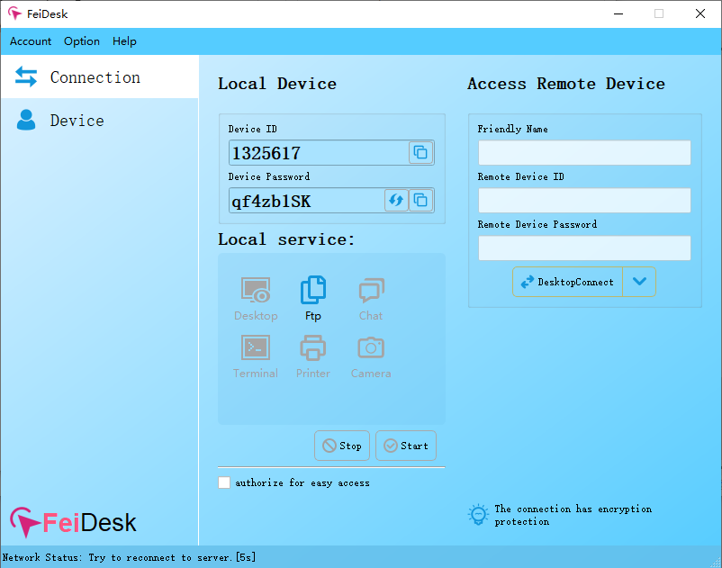
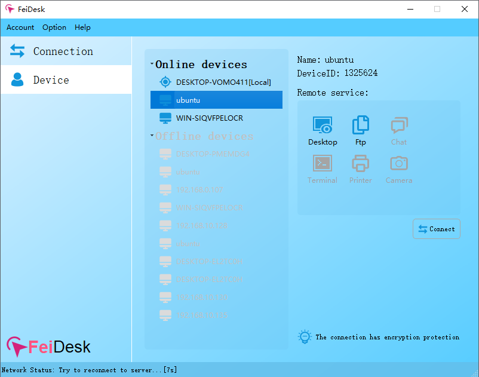
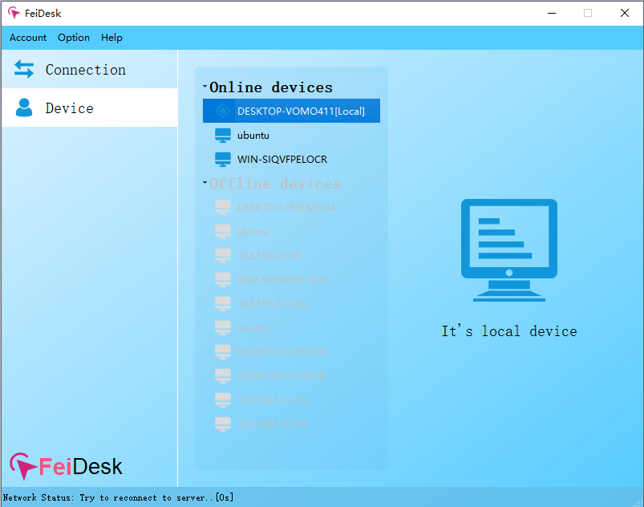
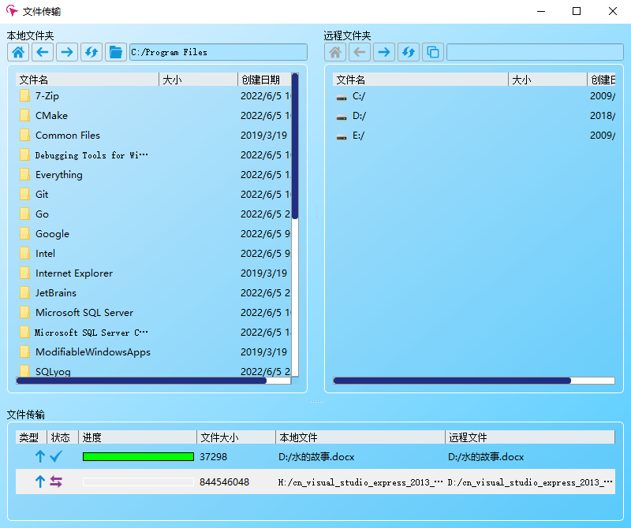
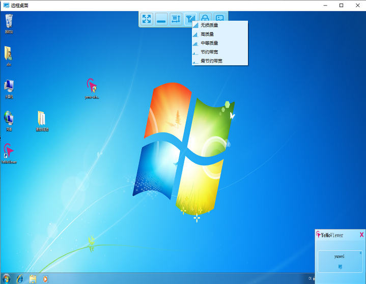

   
  [<a href="README.md">English</a>] | [<a href="README-zh.md">中文</a>]  

# 概要
跨平台P2P远程桌面管理工具，开箱即用，无需配置，安全稳定。

## 特性描述
- 支持Windows / Linux / MacOSX，后续也支持安卓和IOS等。
- 支持本地服务开启或禁用功能，让服务的每次运行均在掌握中。
- 支持服务被连接时的弹框提示和断开功能，让用户可以随时管理访问。
- 支持远程桌面访问功能。
  - 支持自动琐屏
  - 支持隐私屏
  - 支持桌面声音回放
  - 支持无损画质、高清画质、普通画质、经典16位、15位、8位等图像格式的自由切换
- 支持远程文件管理功能。
  - 支持文件上传下载、断点续传。
  - 支持目录创建
- 支持远程终端访问功能。
  - 支持远程Windown / Linux / MacOSX的系统终端访问
- 支持远程聊天文本交互功能。
- 支持Web端设备管理功能如开启、禁用、访问日志等。
- 支持私有化部署
- 支持基于TCP或UDP的P2P直连或中继连接模式。
- 支持...

## 仓库模块说明
客户端代码除与服务端通迅模块外，其它模块全部开源，部份模块来自[WoVNC](http://wovnc.com)和[WoTerm](http://woterm.com)开源项目。

## 更多信息: 
<a href="http://www.feidesk.com">http://www.feidesk.com</a>

## 程序下载:
<a href="http://feidesk.com">http://feidesk.com</a>

## 界面预览

