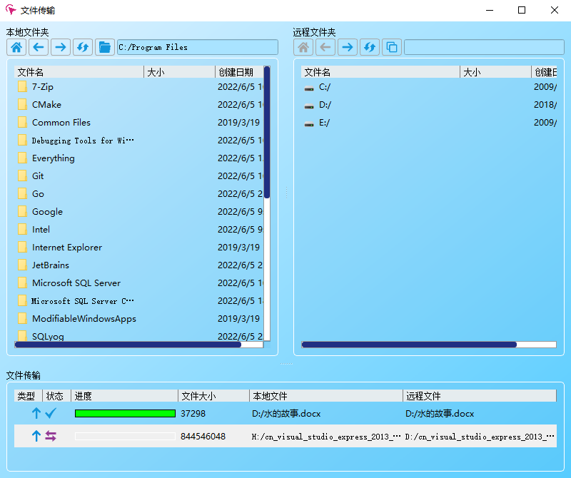
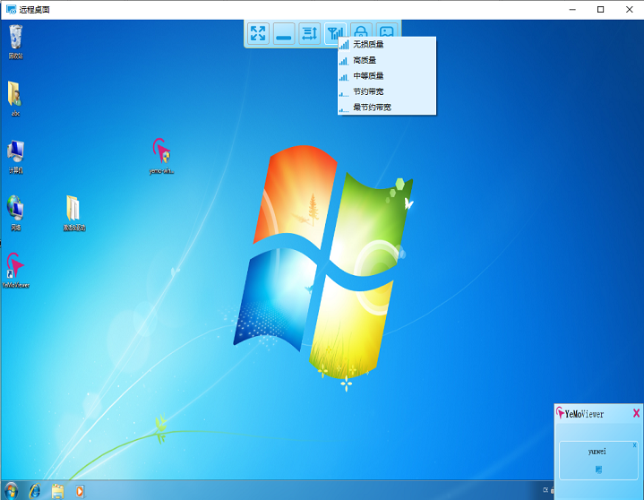

   
  [<a href="README.md">English</a>] | [<a href="README-zh.md">中文</a>]  

# Overview
The goal of this project is to provide a safe and convenient cross platform remote desktop tool for individuals or teams

Tt is full opensource except network protocol module for security.

## Feature
- Support window / linux / macosx and more later.
- Support remote desktop a
- Support floating tab which makes it more convenient for multiple windows to work together.
- Infinite window segmentation, as long as the screen is large enough, it can be divided as it wants.
- Key word search and filtering, no matter how many records, can also be located at a high speed.
- There are dozens of terminal colors, and there is always a favorite one

## Details: 
<a href="http://www.feidesk.com">http://www.feidesk.com</a>

## Binary Program:
<a href="http://feidesk.com">http://feidesk.com</a>

## UI Preview

