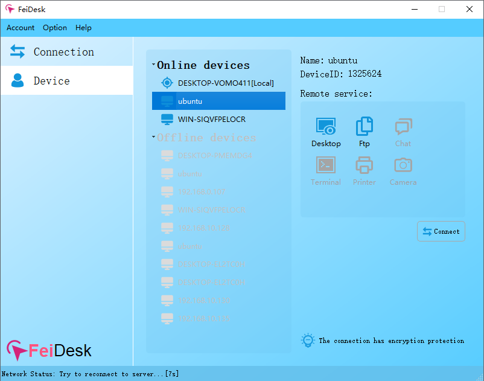

   
  [<a href="README.md">English</a>] | [<a href="README-zh.md">中文</a>]  

# Overview
Cross platform P2P remote desktop management tool, out of the box, no configuration, safe and stable.

## Functions description
- Support Windows / Linux / MacOSX.
- Enable or disable the local service, so that each operation of the service is under control.
- Support pop-up prompt and disconnection function when the service is connected, so that users can manage access at any time.
- Support remote desktop access.
  - It supports automatic screen lock when the network is disconnected or remote operation is ended to prevent accidental loss caused by manipulation by others.
  - Support remote black screen mode to prevent the work process from being watched.
  - Support sound playback of remote desktop.
  - Support the free switching of lossless image quality, high-definition image quality, ordinary image quality, classic 16 bit, 15 bit, 8-bit and other image formats.
  - It supports multi screen mode and switching modes such as stretching, shared screen and split screen.
- Support remote file management function.
  - Support file upload and download and breakpoint resume.
  - Support create new directory.
- Support remote terminal access function.
  - Support remote Windows/Linux/MacOSX system terminal access.
- Support remote chat text interaction function.
- Support device management functions on website, such as enabling, disabling, and accessing logs.
- Support privatization deployment.
- Supports TCP or UDP based P2P direct connection or relay connection mode, automatic switching and manual designation.
- Support...

## Module description
The client code is open source except for the communication module with the server. Some modules are from [WoVNC](http://wovnc.com) And [WoTerm](http://woterm.com) Open source projects.

## More information: 
<a href="http://www.feidesk.com">http://www.feidesk.com</a>

## Binary download:
<a href="http://feidesk.com">http://feidesk.com</a>

## UI preview

